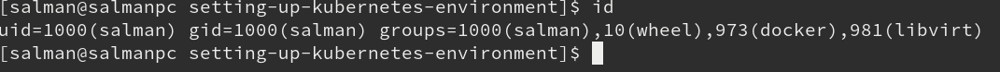

# About the repo:
A repository to help setting up Kubernetes environment on Fedora 31 - Created by Salman Mukhtar
* Preparing linux
* Install & setup docker engine
* Install & setup docker compose
* Install kvm
* Install & setup gcloud & kubectl (For remote kubernetes cluster)
* Install & setup minikube (For local kubernetes cluster)
  * Without using google cloud sdk
  * By using google cloud sdk
* Install & setup Metallb (Load Balancer - Optional)
* Install & setup Heml (Optional)

# Preparing linux

* **Disable SELinux**

Linux is regarded as one of the most secure operating systems you can use today, that is because of its illustrious security implementation features such as SELinux. Disabling it makes life easier for installation of Docker, Docker compose and so on.

To disble SELinux do the following as root
```
vi /etc/selinux/config
```
Change following line (As shown in the picture)

`SELINUX=enforced`
 
With

`SELINUX=disabled`


|  |
| ------------------------------------------------------------------- |

* **Disable firewall**

To disable the firewall use following command as Root user
```
systemctl disable firewalld
```
# Install & setup docker engine

1 - Make sure you have latest version of docker. Remove older version of docker if installed. Run following command
```
udo dnf remove docker \
                  docker-client \
                  docker-client-latest \
                  docker-common \
                  docker-latest \
                  docker-latest-logrotate \
                  docker-logrotate \
                  docker-selinux \
                  docker-engine-selinux \
                  docker-engine
```

2 - Install docker by using repository method
```
sudo dnf -y install dnf-plugins-core

sudo dnf config-manager \
    	--add-repo \
    	https://download.docker.com/linux/fedora/docker-ce.repo

sudo dnf install docker-ce docker-ce-cli containerd.io
 ```
3 - Add your user to group docker 

Make sure your user is a member of the group "docker". If not, add it with gpasswd -a <username> docker. You will need to logout (of the GUI session) and login again for the changes to take effect. Run the following command as **Root** user.

`gpasswd -a salman docker`

4 - Cgroups Exception

First install grubby by using following command
```
yum install -y grubby
```

For Fedora 31 and higher, you need to enable the [backward compatibility for Cgroups](https://fedoraproject.org/wiki/Common_F31_bugs#Other_software_issues)

```
grubby --update-kernel=ALL --args="systemd.unified_cgroup_hierarchy=0"
```

After running the command, you must reboot for the changes to take effect.

5 - Enable & Start Docker

After reboot run following commands to enable and run docker engine.

```
systemctl enable docker
systemctl start docker
```
# Install & setup docker compose

To install docker-compose run following command
```
curl -L "https://github.com/docker/compose/releases/download/1.25.4/docker-compose-$(uname -s)-$(uname -m)" -o /usr/local/bin/docker-compose
```

When its done then apply executable permissions to binary
```
sudo chmod +x /usr/local/bin/docker-compose
```

Check if its running
```
docker-compose --version
```

|  |
| ------------------------------------------------------------------- |

# Install kvm

KVM is world's strongest, most efficient and most lightweight Hypervisor. It runs directly inside the Linux kernel - as a loadable kernel module. RedHat (world's largest open source company) uses KVM in the heart of it's **RedHat Enterprise Virtualization** product. AWS (the biggest cloud provider) is also moving it's infrastructure from XEN to KVM.

**Note:** This document was written for a computer, which has Fedora Linux as Host OS and KVM as Hypervisor. If you have a different OS or Hypervisor on your computer, then you need to consult a different guide for installing minikube on your computer.

Run following command to install kvm

```
yum -y groupinstall virtualization
```

The enable kvm by using following
```
systemctl enable libvirtd
```
Make sure your user is a member of the group "libvirt" (or "libvirtd"). If not, add it with `gpasswd -a <username> libvirt`. You will need to logout (of the GUI session) and login again for the changes to take effect.

```
gpasswd -a salman libvirt
```

Verify with the `id` command:

|  |
| ------------------------------------------------------------------- |

# Install & setup gcloud (For remote kubernetes cluster)

Update YUM with Cloud SDK repo information: (Run as Root)
```
tee -a /etc/yum.repos.d/google-cloud-sdk.repo << EOM
[google-cloud-sdk]
name=Google Cloud SDK
baseurl=https://packages.cloud.google.com/yum/repos/cloud-sdk-el7-x86_64
enabled=1
gpgcheck=1
repo_gpgcheck=1
gpgkey=https://packages.cloud.google.com/yum/doc/yum-key.gpg
       https://packages.cloud.google.com/yum/doc/rpm-package-key.gpg
EOM
```
Install the Cloud SDK:
```
yum install google-cloud-sdk
```
Run gcloud init to get started:
```
gcloud init
```
Install kubectl
```
yum install -y kubectl
```
# Install & setup minikube (For local kubernetes cluster)

**1 - Without using google cloud sdk**

Install minikube: (Run the commands as root)
```
curl -Lo minikube https://storage.googleapis.com/minikube/releases/latest/minikube-linux-amd64 \
  && chmod +x minikube

mkdir -p /usr/local/bin/

install minikube /usr/local/bin/
```
**2 - By using google cloud sdk**

If you have Google-Cloud-SDK already installed on your computer, then you should know that it provides lots of packages, such as `kubectl`, *as well as* `minikube`! You can install these using gcloud commands:
```
gcloud components list

gcloud components install COMPONENT_ID
```

In case you installed google-cloud-sdk YUM repository, then installing these packages is as simple as `yum install <package-name>` 

```
[root@salmanpc ~]# yum --disablerepo="*" --enablerepo="google-cloud-sdk" list available
Last metadata expiration check: 1:14:21 ago on Thu 08 May 2020 00:26:10 AM CEST.
Available Packages
google-cloud-sdk.noarch                                                        289.0.0-1            google-cloud-sdk
google-cloud-sdk-anthos-auth.x86_64                                            289.0.0-1            google-cloud-sdk
google-cloud-sdk-app-engine-go.x86_64                                          289.0.0-1            google-cloud-sdk
google-cloud-sdk-app-engine-grpc.x86_64                                        289.0.0-1            google-cloud-sdk
google-cloud-sdk-app-engine-java.noarch                                        289.0.0-1            google-cloud-sdk
google-cloud-sdk-app-engine-python.noarch                                      289.0.0-1            google-cloud-sdk
google-cloud-sdk-app-engine-python-extras.noarch                               289.0.0-1            google-cloud-sdk
google-cloud-sdk-bigtable-emulator.x86_64                                      289.0.0-1            google-cloud-sdk
google-cloud-sdk-cbt.x86_64                                                    289.0.0-1            google-cloud-sdk
google-cloud-sdk-cloud-build-local.x86_64                                      289.0.0-1            google-cloud-sdk
google-cloud-sdk-datalab.noarch                                                289.0.0-1            google-cloud-sdk
google-cloud-sdk-datastore-emulator.noarch                                     289.0.0-1            google-cloud-sdk
google-cloud-sdk-firestore-emulator.noarch                                     289.0.0-1            google-cloud-sdk
google-cloud-sdk-kind.x86_64                                                   289.0.0-1            google-cloud-sdk
google-cloud-sdk-kpt.x86_64                                                    289.0.0-1            google-cloud-sdk
google-cloud-sdk-minikube.x86_64                                               289.0.0-1            google-cloud-sdk
google-cloud-sdk-pubsub-emulator.noarch                                        289.0.0-1            google-cloud-sdk
google-cloud-sdk-skaffold.x86_64                                               289.0.0-1            google-cloud-sdk
google-cloud-sdk-spanner-emulator.x86_64                                       289.0.0-1            google-cloud-sdk
google-cloud-sdk-tests.noarch                                                  289.0.0-1            google-cloud-sdk
kubectl.x86_64                                                                 1.18.1-0             google-cloud-sdk
[root@salmanpc ~]# 
```

```
[root@salmanpc ~]# yum search minikube
Last metadata expiration check: 0:45:15 ago on Thu 08 May 2020 00:27:20 AM CEST.
===================== Name Matched: minikube ======================
google-cloud-sdk-minikube.x86_64 : Google Cloud SDK
[root@salmanpc ~]# 
``` 

### Install the minikube package:
``` 
[root@salmanpc ~]# yum -y install google-cloud-sdk-minikube.x86_64
Last metadata expiration check: 0:47:29 ago on Thu 08 May 2020 00:27:49 AM CEST.
Dependencies resolved.
===================================================================
 Package                   Arch   Version   Repository        Size
===================================================================
Installing:
 google-cloud-sdk-minikube x86_64 289.0.0-1 google-cloud-sdk  13 M

Transaction Summary
===================================================================
Install  1 Package

Total download size: 13 M
Installed size: 43 M
Downloading Packages:
02311b8ff662232b90e0df30503bba809f 3.2 MB/s |  13 MB     00:04    
-------------------------------------------------------------------
Total                              3.2 MB/s |  13 MB     00:04     
Running transaction check
Transaction check succeeded.
Running transaction test
Transaction test succeeded.
Running transaction
  Preparing        :                                           1/1 
  Installing       : google-cloud-sdk-minikube-289.0.0-1.x86   1/1 
  Running scriptlet: google-cloud-sdk-minikube-289.0.0-1.x86   1/1 
  Verifying        : google-cloud-sdk-minikube-289.0.0-1.x86   1/1 

Installed:
  google-cloud-sdk-minikube-289.0.0-1.x86_64                       

Complete!
[root@salmanpc ~]#
``` 

### Setup minikube VM:
```
[salman@salmanpc ~]$ minikube start --driver=kvm2
😄  minikube v1.9.2 on Fedora 31
    ▪ KUBECONFIG=/home/salman/.kube/config:/home/salman/.kube/kubeadm-cluster.conf
✨  Using the kvm2 driver based on user configuration
💾  Downloading driver docker-machine-driver-kvm2:
    > docker-machine-driver-kvm2.sha256: 65 B / 65 B [-------] 100.00% ? p/s 0s
    > docker-machine-driver-kvm2: 13.88 MiB / 13.88 MiB  100.00% 2.46 MiB p/s 5
💿  Downloading VM boot image ...
    > minikube-v1.9.0.iso.sha256: 65 B / 65 B [--------------] 100.00% ? p/s 0s
    > minikube-v1.9.0.iso: 174.93 MiB / 174.93 MiB [-] 100.00% 6.20 MiB p/s 29s
👍  Starting control plane node m01 in cluster minikube
💾  Downloading Kubernetes v1.18.0 preload ...
    > preloaded-images-k8s-v2-v1.18.0-docker-overlay2-amd64.tar.lz4: 542.91 MiB
🔥  Creating kvm2 VM (CPUs=2, Memory=3900MB, Disk=20000MB) ...
🐳  Preparing Kubernetes v1.18.0 on Docker 19.03.8 ...
🌟  Enabling addons: default-storageclass, storage-provisioner
🏄  Done! kubectl is now configured to use "minikube"

❗  /usr/local/bin/kubectl is v1.13.4, which may be incompatible with Kubernetes v1.18.0.
💡  You can also use 'minikube kubectl -- get pods' to invoke a matching version
[salman@salmanpc ~]$ 
```
At this point, you should see minikube VM running in KVM:

|  |
| ------------------------------------------------------------------- |
```
[salman@salmanpc ~]$ kubectl get nodes
NAME       STATUS   ROLES    AGE   VERSION
minikube   Ready    master   2m    v1.18.0
[salman@salmanpc ~]$ 
```
